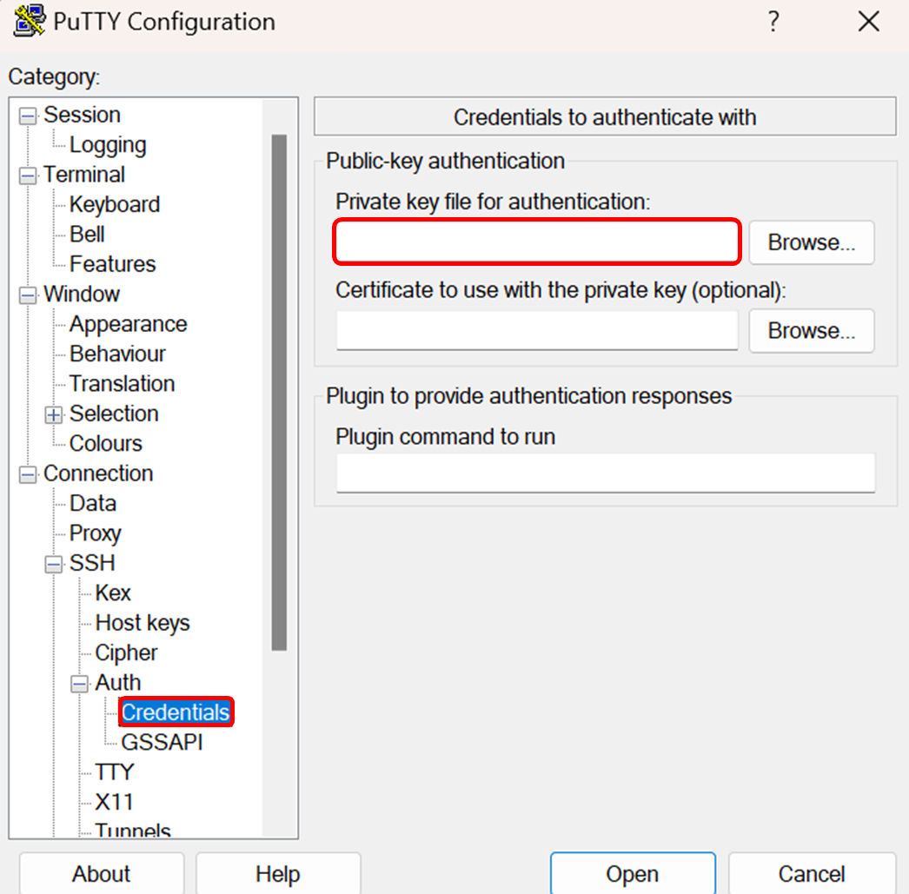
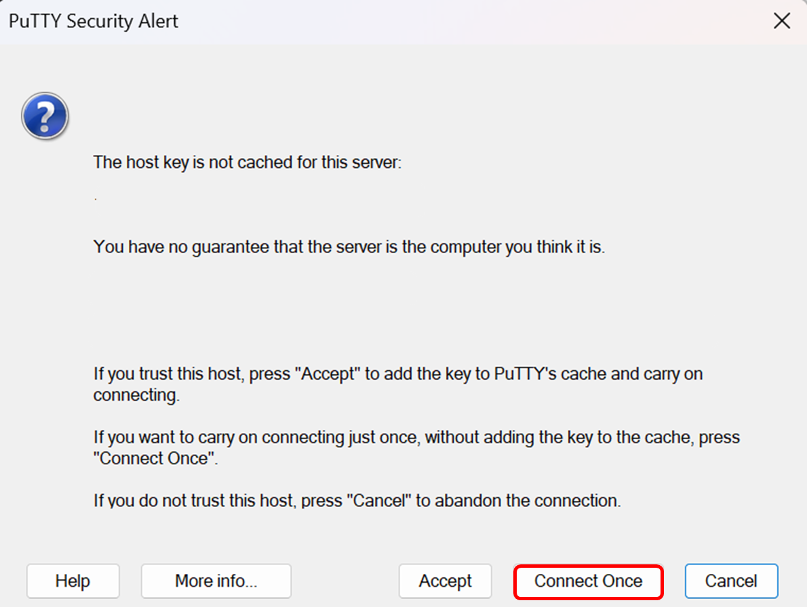
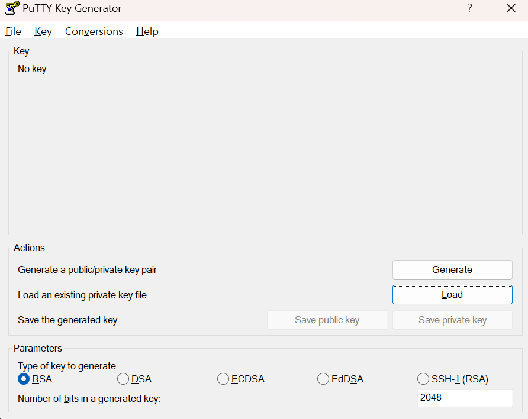
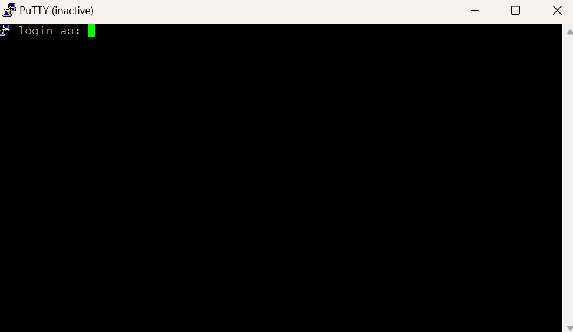

# DevSetting

<h2 style="padding: 10px; border-radius: 10px; border: 1px solid #000000; background-color: rgb(103, 106, 119);"> - Oracle Cloud DB - Mysql 연동 - </h2>

| 번호 | 항목                             |
|:----:|:----------------------------------:|
|  1   | [회원가입 및 로그인](#회원가입-및-로그인)      |
|  2   | [인스턴스 생성](#인스턴스-생성)         |
|  3   | [Oracle VM 초기 구축](#oracle-vm-초기-구축)  |
|  4   | [데이터베이스 DB 시스템 생성](#데이터베이스-db-시스템-생성) |
|  5   | [자율운영 데이터베이스 생성](#자율운영-데이터베이스-생성) |

<h3> 1. Oracle Cloud 회원가입 및 로그인</h3>

"Start for free" 클릭
이후 쭉 진행
---

---

---

---

---

---

<h3> 2. Oracle Instance 생성</h3>

로그인 후 Oracle 메인화면에서 왼쪽 위 버튼 클릭

이후 컴퓨트 - 인스턴스

인스턴스 생성

에서 편집 클릭

이미지 변경 클릭

CentOS -> CentOS 8 Stream 

Shape - VM.Standard.E2.1.Micro

<h4>SSH 키 저장(프라이빗, 퍼블릭)</h4>

<h3> 3. Oracle VM 구축</h3>

왼쪽 위 메뉴 버튼 -> 네트워킹 -> 가상 클라우드 네트워크

이름 링크 클릭

서브넷 링크 클릭

보안목록 링크 클릭

수신 규칙 2개 추가

수신 규칙 설정

수선 규칙 1

| 소스 유형 | 소스 CIDR    | IP 프로토콜 | 소스 포트 범위 (Optional) | 대상 포트 범위(Optional) | 설명(Optional)    |
|:-----------:|:---------------:|:--------------:|:----------------------------:|:-----------:|:---------------:|
| CIDR      | 0.0.0.0/0    | TCP          | 모두 (BLANK)               | 33060      | BLANK               |

수선 규칙 2

| 소스 유형 | 소스 CIDR    | IP 프로토콜 | 소스 포트 범위 (Optional) | 대상 포트 범위(Optional) | 설명(Optional)    |
|:-----------:|:---------------:|:--------------:|:----------------------------:|:-----------:|:---------------:|
| CIDR      | 0.0.0.0/0    | TCP          | 모두 (BLANK)               | 3306      | BLANK               |
         |

<h3> 4. DB 시스템 생성 </h3>

왼쪽 위 메뉴 클릭 -> 데이터베이스 -> DB 시스템 클릭

DB 시스템 생성 클릭

Always Free 클릭

이름 설정 자유

<h4> 3-1. Always Free, 이름, 관리자 인증서 생성(전부), 독립형 설정</h4>

관리자 인증서 생성 기입

독립형 시스템으로 설정

<h3> 5. 자율 운영 데이터베이스 생성</h3>

왼쪽 위 버튼 클릭 -> Oracle Database -> 자율운영 데이터베이스 

자율운영 데이터베이스 생성 클릭

트랜잭션 처리 선택

관리자 인증서 기입

<h3> 6. Putty 연결</h3>
서버와 SSH 통신을 위해 Windows 경우 Putty 등 방법을 사용. Mac은 터미널에서 가능.

<h4> 6-1. 필수 파일 설치</h4>

Puttygen (Putty Key 생성)
- 32bit: https://the.earth.li/~sgtatham/putty/latest/w32/puttygen.exe
- 64bit: https://the.earth.li/~sgtatham/putty/latest/w64/puttygen.exe

Putty (SSH 연결 지원)
- 32bit: https://the.earth.li/~sgtatham/putty/latest/w32/putty.exe
- 64bit: https://the.earth.li/~sgtatham/putty/latest/w64/putty.exe

  
